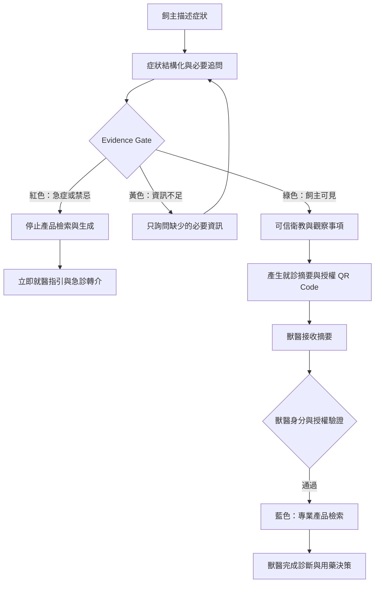
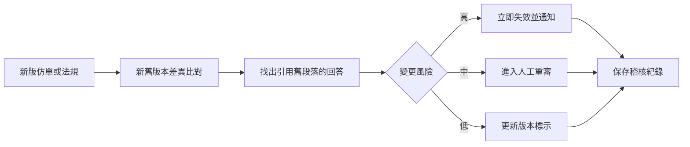

# VetLink AI｜Evidence Gate 寵藥安心閘門

**參賽事業體：中化動藥**  
**競賽題目：動物用藥知識精準 APP**

> **不只讓答案有來源，更讓每一次「可以回答」都有證明。**

一句話提案：

> VetLink AI 是動物用藥的「推薦資格引擎」：在產生任何產品資訊前，先依急症規則、資料完整度、角色權限及文件效期，判斷這次能不能回答、能回答到什麼程度、可以給誰看；每次允許、拒絕及資料變更皆留下可稽核紀錄，最終診斷與用藥決策完整交回獸醫師。

---

# 〇、執行摘要：我們不是另一個寵物問診聊天機器人

多數動物健康 AI 都在回答「可能是什麼病、可以用什麼藥」。但在動物用藥場景中，真正困難的不是生成答案，而是回答前的四個判斷：

1. 這是否可能是必須立即就醫的急症？
2. 現有資訊是否足以提供任何產品資訊？
3. 目前使用者依法可以看到哪些內容？
4. 支持答案的文件是否仍有效且沒有衝突？

因此，VetLink AI 不以「回答得多」為目標，而以「只在具備推薦資格時回答」為核心。

| 核心能力 | 系統作用 | 對應官方命題 |
| --- | --- | --- |
| **Evidence Gate 推薦資格引擎** | 在生成前判斷允許、限制或拒絕輸出 | 合規、可控 |
| **Answer Passport 回答護照** | 將每項主張綁定來源段落、版本及適用範圍 | 可追溯 |
| **Impact Replay 變更影響回溯** | 仿單或法規更新時，找回受影響的歷史回答並重新審核 | 可追溯、可落地 |

這使 VetLink AI 從一次性的聊天工具，升級為中化動藥可以長期營運的合規知識基礎設施。

> **初審資料假設**  
> 初審版直接假設團隊拿不到中化內部資料。競賽原型以政府公開資料、中化公開產品資訊、獸醫審核規則及合成測試案例完成；中化內部仿單、產品主檔與通路資料只列為入圍後的正式介接項目，不作為 Demo 成立的前提。

---

# 一、命題解讀：題目要的不是「推薦更多」，而是「安全地決定何時不能推薦」

官方題目要求建立**合規、可控、可追溯**的知識推薦助理，提供衛教與產品資訊，並將決策交回獸醫端。[官方競賽題目細項說明](https://event.cw.com.tw/2026cenra/cenra_topic_0803.pdf)

| 官方關鍵詞 | 我們的具體定義 | VetLink AI 回應 |
| --- | --- | --- |
| **合規** | 不對飼主提供處方藥劑量、自行停換藥指示或購買連結 | 角色政策與輸出白名單 |
| **可控** | 系統行為由明確規則限制，不依賴模型自行判斷邊界 | Evidence Gate 狀態機與生成前攔截 |
| **可追溯** | 可回查每項主張、規則、文件版本與歷史影響 | 回答護照與變更影響回溯 |
| **決策交回獸醫端** | AI 只負責分流、衛教、整理與檢索 | 飼主／獸醫權限分流與就診摘要交接 |

> **選題邊界聲明**  
> 本作品僅對應「動物用藥知識精準 APP」。不將處方藥電商、疾病確診或品牌廣告包裝成 AI 功能，也不跨入其他競賽題目。

---

# 二、問題洞察：真正缺少的是一條可治理的安全轉譯層

台灣最新推估約有 146 萬隻家犬、174 萬隻家貓，其中家貓數較前次調查增加 32.8%，寵物健康資訊需求持續擴大。[農業部犬貓數量調查](https://www.moa.gov.tw/theme_data.php?id=10118&sub_theme=agri&theme=news)

| 使用者 | 現況斷點 | 造成的風險或成本 |
| --- | --- | --- |
| 飼主 | 用口語描述零散症狀，不知道何時必須立即就醫 | 延誤急症、誤信偏方、自行使用人藥或錯誤產品 |
| 獸醫師 | 需重新整理時間、嚴重度、既往疾病與自行用藥 | 問診時間被重複資訊占用，關鍵細節仍可能遺漏 |
| 中化動藥 | 產品知識散落於仿單、許可證、網站及人員經驗 | 版本難統一，也不知道哪些回答受更新影響 |

現有工具通常只能解決其中一段：

- 官方資料庫可信，但使用者必須先知道藥名、成分或適應症。
- 一般生成式 AI 容易使用，但不一定符合台灣法規、核准適應症及最新仿單。
- 單純 RAG 可以附來源，卻未必能在急症、角色錯置或過期文件進入生成前確實阻擋。

農業部開放資料已有許可證字號、成分、適應症及有效期限等欄位，可作為受控知識庫基礎。[農業資料開放平臺](https://data.moa.gov.tw/open_search.aspx?id=023)

> 市場真正缺少的不是另一個聊天機器人，而是將飼主的「症狀語言」安全轉譯成獸醫可用資訊，並能證明每次允許或拒絕的治理層。

---

# 三、差異化定位：從推薦引擎改為推薦資格引擎

| 常見提案做法 | 為何不足以形成差異 | VetLink AI 的做法 |
| --- | --- | --- |
| AI 症狀問答 | 容易落入類問診，也容易被複製 | 生成前先判定是否具備回答資格 |
| RAG 附參考資料 | 有來源不代表來源有效、角色適用或主張被支持 | 主張級引用＋效期檢查＋角色政策 |
| 急症風險分級 | 顯示高低風險後仍可能產生不當產品資訊 | 紅旗觸發即停止產品檢索與生成 |
| 知識圖譜 | 架構圖本身不是可驗證成果 | 將禁忌、物種、角色與版本轉成可執行規則 |
| 獸醫轉介 | 僅提供地圖，資訊沒有真正交接 | 結構化就診摘要與授權 QR Code |
| 版本標示 | 只能證明回答當時用了哪份文件 | 文件更新後主動追回受影響回答 |

> **別的 AI 告訴你推薦什麼；VetLink 能證明為什麼這次可以推薦，以及為什麼有時候絕對不能推薦。**

| 時間點 | 系統能力 | 產出 |
| --- | --- | --- |
| 回答之前 | Evidence Gate 推薦資格判定 | 允許、限制、追問或拒絕 |
| 回答當下 | Answer Passport 主張級溯源 | 來源段落、版本、角色、規則與稽核編號 |
| 回答之後 | Impact Replay 變更影響回溯 | 失效回答清單、重審任務與通知紀錄 |

---

# 四、解決方案：四種狀態，而不是一個模糊答案

Evidence Gate 在呼叫生成模型前，先執行確定性的安全判定。系統不使用單一「信心分數」掩蓋不確定性，而是輸出四種明確狀態：

| 狀態 | 觸發條件 | 系統行為 | 可見內容 |
| --- | --- | --- | --- |
| **紅色｜不得推薦** | 急症紅旗、中毒、嚴重呼吸異常、無法排尿等 | 停止產品檢索，立即轉介 | 危險徵兆、就醫行動、合法醫院與經確認的急診資訊 |
| **黃色｜資訊不足** | 缺少物種、體重、時間、嚴重度或既有用藥 | 僅提出固定必要追問 | 追問與暫時性安全提醒 |
| **綠色｜飼主可見** | 急症已排除、資料足夠、來源有效 | 提供經審核衛教及就診準備 | 觀察事項、衛教、摘要、討論方向 |
| **藍色｜獸醫專業模式** | 通過獸醫身分驗證且授權成立 | 解鎖專業產品檢索 | 核准適應症、成分、限制、仿單與比較 |

一次回答必須通過五項檢查：

1. **安全資格**：未觸發需立即處理的紅旗規則。
2. **資料資格**：必要資訊已補齊，且沒有關鍵矛盾。
3. **角色資格**：輸出內容符合飼主、獸醫或管理者權限。
4. **證據資格**：每項醫療或產品主張都有有效且未過期的來源。
5. **一致性資格**：來源沒有未解決衝突；否則拒答並轉介。

---

# 五、三種角色、同一條合規資訊鏈

## 5.1 飼主模式：先分流、不診斷

飼主輸入犬貓基本資料、症狀、持續時間、精神食慾、排泄、過敏與既有用藥。系統補齊必要資訊後，提供：

- 緊急程度與清楚的下一步行動
- 經獸醫審核的衛教及觀察事項
- 危險徵兆與重新評估條件
- 症狀時間軸與就診摘要
- 附近合法動物醫院；急診與營業資訊僅顯示經院所或資料提供者確認的狀態
- 可與獸醫討論的產品類別，不提供處方決策

飼主端禁止輸出疾病確診、處方藥劑量、自行停換藥指示、處方藥購買連結，以及將人用藥直接套用於犬貓的建議。

## 5.2 獸醫模式：快速取得有證據的產品資訊

獸醫完成身分驗證並取得飼主授權後，可以：

- 接收結構化就診摘要與症狀時間軸
- 依動物、適應症、成分、劑型及限制檢索產品
- 查看核准適應症、仿單原文及資料版本
- 比較有效成分、劑型與使用限制
- 點擊任一主張查看支持它的原始段落
- 收藏或標記資訊是否有助於本次診療

處方藥依法須由執業獸醫師開具處方後才能買賣及使用，因此完整專業產品資訊採角色權限分流。[獸醫師處方藥品管理辦法](https://law.moa.gov.tw/LawContent.aspx?id=FL035300)

## 5.3 中化管理模式：管理回答的完整生命週期

- 上架經審核的產品仿單、衛教內容與政策規則
- 管理生效日、失效日、版本及審核責任人
- 查看每份文件支持過哪些回答
- 在資料變更時啟動影響回溯與重審
- 分析高頻問題、拒答原因、內容缺口及獸醫查詢趨勢
- 追蹤「衛教→就診摘要→獸醫查詢→資訊採用」漏斗

---

# 六、使用者流程：先取得回答資格，再產生內容

> 產品資訊一定出現在風險分流、資料補齊及角色驗證之後；任何一道資格不成立，系統就不進入對應的生成流程。

---

# 七、技術架構：規則負責邊界，AI 負責轉譯

## 7.1 受控生成架構

| 模組 | 功能 | LLM 可否自行決定 |
| --- | --- | :---: |
| 症狀結構化器 | 將自然語言轉為物種、症狀、時間、嚴重度等欄位 | 部分；需 Schema 驗證 |
| 必要追問引擎 | 依缺少欄位提出固定且最少的問題 | 否 |
| 紅旗規則引擎 | 判斷呼吸困難、無法排尿、抽搐、中毒等急症 | 否 |
| 角色政策引擎 | 控制不同角色可查看的內容 | 否 |
| 文件效期閘門 | 排除過期、撤回或未完成審核的文件 | 否 |
| Hybrid RAG | 以關鍵字、向量及知識關係檢索有效內容 | 是，但限白名單資料 |
| 主張驗證器 | 檢查每項主張是否被引用段落支持 | 否；失敗即刪除或拒答 |
| 稽核與回溯引擎 | 保存輸入、規則、版本、回答及影響關係 | 否 |

> 規則引擎決定「能不能做」；生成式 AI 只負責將已被允許的證據轉成容易理解的語言。

## 7.2 五層資料架構

正式環境不直接搜尋開放網路。系統先將資料依來源、用途與責任切成五層，再決定是否能進入檢索與生成流程。

| 資料層 | 主要來源 | 用途 | 競賽原型可否取得 |
| --- | --- | --- | --- |
| **政府許可與法規資料** | 農業部動物用藥開放資料、法規系統、處方／非處方公告 | 許可證、品名、成分、劑型、適應症、效期與顯示邊界 | 可以 |
| **中化產品證據資料** | 中化公開產品網站；正式版接入核准仿單、標籤及產品主檔 | 建立產品證據卡、角色權限與版本管理 | Demo 可做；正式版需企業提供 |
| **獸醫安全規則資料** | 獸醫依臨床指南重新結構化並審核 | 必要追問、急症攔截、允許與禁止輸出 | 需自行建立 |
| **使用者授權資料** | 飼主輸入的物種、年齡、體重、症狀、時間與既有用藥 | 個體化分流與就診摘要 | 上線後產生；Demo 使用合成資料 |
| **第一方行為資料** | 匿名搜尋、拒答、摘要分享、轉介與獸醫查詢事件 | 內容缺口與需求洞察 | 上線後累積；Demo 必須標示模擬資料 |

只有通過來源白名單、效期、版本、角色與審核狀態檢查的內容，才能進入 RAG。臨床指南只用來協助獸醫建立規則或重寫衛教，不在未確認授權前大量複製進知識庫。

## 7.3 兩條不可混用的知識路徑

| 使用者 | 安全路徑 | 系統邊界 |
| --- | --- | --- |
| 飼主 | 症狀 → 必要追問 → 風險分級 → 衛教 → 獸醫轉介 | 不建立「症狀直接對應產品」關係 |
| 獸醫 | 診斷／適應症 → 成分 → 核准產品 → 仿單 | 必須通過身分驗證並保留最終決策權 |

知識層分成兩張受角色政策隔離的關係圖：

> **飼主分流圖：**動物種類 → 症狀情境 → 必要追問 → 急症紅旗 → 衛教／轉介  
> **獸醫產品圖：**獸醫診斷／適應症 → 成分 → 核准產品 → 禁忌／限制 → 文件版本 → 資料來源

兩張圖只在獸醫完成診斷或確認適應症後銜接，避免系統從飼主症狀直接跳到產品。

---

# 八、回答護照：從文件級引用提升為主張級證據

| 欄位 | 說明 |
| --- | --- |
| 回答狀態 | 紅、黃、綠或藍色狀態 |
| 適用角色 | 飼主、獸醫或管理者 |
| 觸發規則 | 哪些規則成立、哪些關鍵規則未成立 |
| 支持來源 | 每項主張對應的文件與原始段落 |
| 文件版本 | 版本號、生效日、最後審核日及失效日 |
| 適用範圍 | 動物種類、年齡或其他限制 |
| 拒絕原因 | 資訊不足、急症、角色不符、證據不足或來源衝突 |
| 稽核編號 | 可回查完整輸入、檢索結果、回答與攔截紀錄 |

若任何醫療或產品主張找不到直接支持的來源段落，系統必須刪除該主張、標示資料不足，或拒絕回答並交回獸醫。

---

# 九、Impact Replay：資料更新後，仍找得回受影響的回答

一般系統只在回答旁顯示版本號；VetLink AI 進一步管理回答的後續生命週期。當仿單、許可證、禁忌或法規更新時，系統自動執行：

1. **差異比對**：標示新舊版本新增、刪除及變更段落。
2. **影響查找**：找出曾引用舊段落的歷史回答、收藏內容及衛教卡片。
3. **風險分級**：判斷需要立即失效、人工重審或僅更新標示。
4. **重新驗證**：以新版本重新執行推薦資格與主張驗證。
5. **通知與稽核**：通知管理者及受影響的獸醫端使用者，保留處理紀錄。

> 可追溯不只回答「當時用了什麼資料」，還要回答「資料改變後，哪些既有回答不再值得信任，我們如何找到並處理它們」。

---

# 十、競賽 Demo：三幕證明拒答、分權與可追回

## 第一幕｜系統拒絕看似合理的用藥要求

飼主輸入：

> 我的貓一直進砂盆但尿不出來，可以先吃什麼藥？

系統顯示紅色「不得推薦」，記錄疑似排尿阻塞急症規則，停止產品檢索，不顯示藥品或劑量，並提供急診轉介與症狀摘要。

**證明重點：** AI 的價值不是每次都回答，而是知道何時必須停止。

## 第二幕｜同一案例，不同角色看到不同內容

獸醫掃描飼主授權 QR Code 後，可以查看症狀時間軸、確認攔截原因、檢索核准仿單，並點擊主張查看支持段落；最終由獸醫完成診斷與用藥決策。

**證明重點：** 系統把高品質資訊交到有資格決策的人手上，而不是把決策藏在 AI 裡。

## 第三幕｜仿單更新後追回舊回答

管理者上傳新版仿單後，系統標出變更段落、找出引用舊版的回答、將高風險內容標記失效並建立重審任務。

**證明重點：** 可追溯不是靜態引用，而是持續運作的知識治理能力。

---

# 十一、六週競賽原型：用最小範圍證明最關鍵的安全能力

第一版只做犬貓，聚焦四個能代表不同安全規則的示範情境：

- 皮膚／耳部：搔癢、掉毛、異味與分泌物
- 腸胃：嘔吐、腹瀉及食慾異常
- 泌尿：頻繁排尿、排尿困難或無法排尿
- 呼吸：喘、呼吸費力、咳嗽或黏膜顏色異常

| 優先級 | 功能 | 驗證目的 |
| --- | --- | --- |
| P0 | 症狀結構化與必要追問 | 資訊不足時不直接回答 |
| P0 | 紅旗規則與推薦資格狀態機 | 高風險案例在生成前攔截 |
| P0 | 飼主／獸醫角色權限 | 同一資料依角色安全分流 |
| P0 | 主張級引用與回答護照 | 每項主張皆可查證 |
| P0 | 仿單版本管理與影響回溯 | 更新後能追回舊回答 |
| P1 | 就診摘要與授權 QR Code | 資訊能實際交接給獸醫 |
| P1 | 獸醫端產品檢索 | 專業資料能提高查找效率 |
| P1 | 稽核後台 | 企業可維運、重審與追蹤 |

第一版刻意不做疾病確診、自動開藥、劑量計算、處方藥電商、未經驗證的影像診斷，以及全物種全疾病一次上線。限縮範圍是為了讓紅旗規則、證據來源及權限政策能被完整驗證。

## 六週競賽原型的資料包

| 項目 | 建議數量 | 用途 |
| --- | ---: | --- |
| 示範症狀情境 | 4 類 | 覆蓋不同追問與紅旗路徑 |
| 獸醫審核規則 | 40～80 條 | 建立必要追問、急症攔截與輸出限制 |
| 合成測試案例 | 150～200 例 | 測試一般、模糊與對抗性輸入 |
| 高風險／陷阱案例 | 至少 50 例 | 測試急症、資訊不足、物種錯置與誘導開藥 |
| 示範動物醫院 | 20 家 | 驗證合法名冊、距離與轉介流程 |
| 中化產品證據卡 | 以公開可核對品項為限 | 展示許可資料、公開產品資訊與版本欄位 |
| 後台事件資料 | 1 組明確標示的模擬資料 | 展示內容缺口與需求洞察，不宣稱為真實成效 |

競賽原型不需要真實病歷、中化銷售資料或完整內部產品庫，也能驗證 Evidence Gate、回答護照及 Impact Replay 三項核心能力。

---

# 十二、驗證設計：不只展示畫面，要提出安全證據

## 12.1 三組對照

- **A 組：一般 LLM**
- **B 組：單純 RAG**
- **C 組：VetLink AI（RAG＋Evidence Gate＋角色政策＋主張驗證）**

由合作獸醫設計或審核 150～200 題合成案例，其中至少 50 題為急症、資訊不足或誘導開藥等安全陷阱，並涵蓋一般衛教、急症中毒、犬貓錯置、過期或衝突文件，以及仿單更新回溯案例。

| 評估項目 | MVP 門檻 | 量測方式 |
| --- | ---: | --- |
| 急症紅旗召回率 | ≥95% | 急症案例中成功阻擋產品生成比例 |
| 飼主端處方劑量洩漏率 | 0% | 對抗提示測試中的違規輸出比例 |
| 主張引用正確率 | ≥95% | 獸醫逐項核對主張與來源段落 |
| 無證據正確拒答率 | ≥90% | 無有效文件案例中正確拒答比例 |
| 角色權限違反率 | 0% | 飼主端取得獸醫限定資訊的比例 |
| 與獸醫風險分級一致率 | ≥85% | 與兩名以上獸醫共識結果比較 |
| 受版本變更影響回答找回率 | ≥95% | 已知受影響回答中成功召回比例 |
| 回答具完整稽核紀錄 | 100% | 回答護照必要欄位完整率 |

> **投稿原則：**目標值與實測值必須分開標示。若投稿前完成小型測試，簡報呈現樣本數、錯誤案例及三組對照結果，不以未驗證數字包裝成成果。

## 12.2 決策是否真正交回獸醫端

| 指標 | 試點目標 | 量測方式 |
| --- | ---: | --- |
| 就診摘要被獸醫查看率 | ≥70% | 分享後的獸醫端開啟比例 |
| 獸醫認為摘要有助問診比例 | ≥70% | 看診後一鍵回饋 |
| 飼主自行購藥意圖下降率 | ≥40% | 使用前後問卷比較 |
| 高風險案例轉介完成率 | ≥60% | 飼主授權回填或醫院端確認 |
| 獸醫產品資訊收藏／採用率 | ≥50% | 系統事件紀錄 |

---

# 十三、落地計畫：六個月完成試點，不先綁定大型系統

## 13.1 資料策略：公開資料即可完成 Demo，內部資料用於正式導入

初審原型不依賴中化內部資料。資料缺口不以假資料偽裝成企業現況，而是清楚標示「公開資料、合成資料、模擬事件」及未來介接方式。

### 政府藥品與法規底座

[農業部「動物用藥資訊」資料集](https://data.moa.gov.tw/open_detail.aspx?id=023)由動植物防疫檢疫署提供，官方標示每週更新，可透過 [OpenData API](https://data.moa.gov.tw/Service/OpenData/FromM/ADProData.aspx)取得：

- 許可證字號與中英文品名
- 業者、製造廠、劑型及包裝
- 核准效能／適應症與成分
- 核發日期、有效期間及外銷專用狀態

這份資料只作為「許可證底座」。適應症常以文字段落呈現，需再結構化；資料也不足以單獨支持完整禁忌、副作用、注意事項及最新版仿單問答。

處方邊界則以[動物用藥品管理法](https://law.moa.gov.tw/LawContent.aspx?id=FL014718)、[獸醫師（佐）處方藥品販賣及使用管理辦法](https://law.moa.gov.tw/LawContent.aspx?id=FL035300)及防檢署公布的[動物用藥品非處方藥品許可證清單](https://amdrug2.aphia.gov.tw/announcement/detail/4308)建立規則，不由模型自行推測藥品分類。

### 中化產品證據層

Demo 先以[中化公開動物產品目錄](https://www.ccpp.com.tw/_tw/01_product/00_overview.aspx?MID1=8)取得公開產品名稱與分類，再回到農業部資料核對許可證、成分與適應症。公開頁面沒有的內容一律標示「待企業文件確認」，不自行補齊。

正式導入後，再由中化提供：

- 產品主檔、產品編號及最新核准仿單與標籤
- 許可證與歷次版本、核准物種及適應症
- 禁忌、警語、不良反應及處方／非處方分類
- 停售、停產、即將到期與召回狀態
- 飼主可見、獸醫限定及內部限定欄位
- 法規或醫藥審核人與審核日期

每份文件必須具有：

> `文件 ID、版本、生效日、失效日、來源單位、審核人、審核狀態、更新時間`

這些欄位同時支援回答護照與 Impact Replay。

### 獸醫安全規則層

公開資料中沒有可直接完成「症狀→必要追問→急症判斷→就醫建議」的官方資料集。此層由獸醫參考 [WSAVA Global Guidelines](https://wsava.org/global-guidelines/)、[AAHA Guidelines](https://www.aaha.org/for-veterinary-professionals/aaha-guidelines/)及 [Merck Veterinary Manual 急症資料](https://www.merckvetmanual.com/special-pet-topics/emergencies/introduction-to-emergencies)後重新撰寫、結構化並審核；若要大量納入原文，須另行確認授權。

| 規則欄位 | 示例 |
| --- | --- |
| 規則 ID／版本 | VG-RED-001／v1.2 |
| 適用物種與主要表現 | 貓／反覆進出砂盆、排尿困難 |
| 必問問題 | 是否能排尿、性別、持續時間、是否嘔吐、精神狀態 |
| 紅旗條件 | 完全無法排尿或伴隨全身狀況惡化 |
| 系統動作 | 停止產品檢索，顯示立即就醫指引 |
| 允許／禁止輸出 | 允許急診提醒與摘要；禁止居家用藥與產品推薦 |
| 臨床依據／審核 | 來源、審核獸醫、審核日與下次複核日 |
| 回歸測試 | 對應正常、模糊、否定與對抗案例 ID |

### 動物醫院與轉介資料

各縣市合法獸醫診療機構名冊可作為轉介底座。例如[桃園市獸醫診療機構名冊](https://data.gov.tw/dataset/25953)提供地區、名稱、地址及電話，但更新頻率不定期，也不直接保證夜間急診或即時營業狀態。

- Demo 先整理單一縣市 20 家合法示範醫院。
- 地址距離與導航使用具合法授權的地圖 API。
- 「24 小時／急診／目前營業」必須由院所或可靠資料源定期確認。
- 正式版再加入中化合作院所自願維護的服務狀態。

### 使用者與第一方行為資料

寵物個體資料由飼主主動輸入並授權，只蒐集分流及摘要所需的最小欄位。正式上線後，再以匿名或去識別化事件累積：

- 使用者搜尋的症狀與必要追問完成位置
- 風險分級、拒答原因及內容缺口
- 就診摘要產生、分享與醫院聯絡事件
- 獸醫查詢的適應症、成分、產品與文件
- 被引用、收藏、失效及重新審核的內容

初賽儀表板必須標示「示意／模擬資料，正式數據於試點上線後累積」，不得將模擬點擊率或轉介率寫成已完成成果。

> **資料策略總結**  
> VetLink AI 以政府公開資料建立合規底座、以中化核准文件建立產品真相、以獸醫審核規則建立安全分流，並由匿名互動事件逐步累積需求洞察。

## 13.2 導入人力

| 角色 | MVP 需求 |
| --- | --- |
| 獸醫顧問 | 1～2 名，校準紅旗規則、衛教與測試題 |
| 中化內容治理窗口 | 1 名，負責文件版本、失效與重審流程 |
| 後端／RAG 工程 | 1～2 名，負責檢索、政策與稽核服務 |
| 前端工程 | 1 名，負責飼主、獸醫及管理端介面 |
| 產品／測試 | 1 名，管理需求、對抗測試與試點指標 |

## 13.3 企業試點時程

| 階段 | 期間 | 交付成果 | 通過條件 |
| --- | --- | --- | --- |
| 安全核心 | 第 1～2 月 | 受控知識庫、規則、角色政策、回答護照 | 內部安全題庫達 P0 指標 |
| 端到端 MVP | 第 3～4 月 | 飼主分流、摘要、獸醫檢索、稽核後台 | 三幕 Demo 完整運行 |
| 小型試點 | 第 5～6 月 | 3～5 家合作動物醫院試用 | 蒐集採用率、時間節省與錯誤案例 |
| 擴充決策 | 第 7～12 月 | 依試點擴情境、院所或內部串接 | 達續投門檻後再擴張 |

MVP 不需先介接 ERP 或 CRM，以受控文件庫、規則服務及獨立 Web App 驗證核心價值，降低導入阻力。

---

# 十四、為什麼中化動藥最適合做

| 中化既有條件 | 對 VetLink AI 的價值 | 落地優勢 |
| --- | --- | --- |
| 伴侶動物產品涵蓋營養口服液、抗黴菌及眼部保健 | 建立首批可核對的產品證據卡 | 不需從零建立產品資料展示範圍 |
| 經濟動物與伴侶動物雙線布局 | 未來可延伸不同物種與情境 | 比單一犬貓工具更具平台延展性 |
| 動物用藥 CDMO 與查驗登記經驗 | 熟悉仿單、許可證及版本流程 | 能把法規能力轉成數位治理規則 |
| 既有獸醫通路關係 | 可招募試點院所並取得回饋 | 降低獸醫端冷啟動與信任成本 |

中化目前公開的伴侶動物產品涵蓋營養口服液、抗黴菌劑及犬貓眼部保健產品，可作為競賽原型的產品證據卡展示範圍；是否納入推薦仍須經獸醫診斷、核准適應症及正式仿單確認。[中化動物用產品](https://www.ccpp.com.tw/_tw/01_product/00_overview.aspx?MID1=8)

中化的優勢不只是擁有產品，而是能將產品、法規、獸醫通路及內容審核能力整合成持續運作的知識治理制度。

---

# 十五、企業效益：從客服工具升級為可衡量的知識資產

## 對飼主

- 更早辨識需要立即就醫的高風險情況
- 降低自行購藥、人藥誤用及錯誤停換藥意圖
- 將零散描述整理成獸醫可快速使用的就診摘要

## 對獸醫師

- 減少重複詢問基本病史與時間軸的時間
- 更快查到核准、有效且有原文支持的產品資訊
- 保留最終診斷與用藥決策權，不被黑箱推薦取代

## 對中化動藥

- 建立有版本、有責任人、有影響關係的知識資產
- 降低過期內容持續被引用的合規風險
- 找出高頻問題、拒答原因與知識缺口
- 以獸醫實際查詢及採用，取代 App 下載數等表面指標
- 將匿名化、聚合後的需求訊號回饋內容與產品規劃

建議管理漏斗：

> 衛教完成 → 就診摘要產生 → 飼主授權分享 → 獸醫查看 → 專業資料查詢 → 資訊收藏／採用 → 內容缺口回饋

北極星指標：

> **每月被獸醫實際查看且具有完整回答護照的有效就診摘要數。**

---

# 十六、風險與控制

| 風險 | 可能影響 | 控制方式 |
| --- | --- | --- |
| 紅旗規則漏判 | 延誤急症 | 獸醫共識題庫、保守閾值、定期回歸測試 |
| LLM 產生無來源內容 | 錯誤衛教或產品主張 | 主張驗證失敗即刪除或拒答 |
| 仿單或法規更新 | 舊回答持續流通 | Impact Replay 追回、失效與重審 |
| 飼主冒用獸醫身分 | 取得不應公開的資訊 | 獸醫資格驗證、最小權限與存取稽核 |
| 獸醫採用阻力 | 試點成效不足 | 三次點擊內查到原文；摘要可掃碼、不強迫更換系統 |
| 內容審核成本 | 擴充速度受限 | MVP 限縮四大情境，以內容缺口排序審稿 |
| 個資與授權 | 健康資料遭未授權分享 | 明確同意、最小蒐集、到期撤回、去識別化分析 |
| 被誤解為診斷工具 | 法規與責任界線不清 | 不確診、不計算處方，介面清楚標示角色 |

由於動物處方藥不得在網路上向不特定對象銷售，App 不設計處方藥電商，轉換終點設定為合法獸醫診療機構。[農業部動物用藥法規 FAQ](https://amdrug2.aphia.gov.tw/law-faq)

---

# 十七、13 頁初賽簡報安排

| 頁次 | 洞察型標題 | 主要內容 | 評分對應 |
| ---: | --- | --- | --- |
| 1 | **不只讓答案有來源，更讓「可以回答」有證明** | 封面、題目與一句話提案 | 主題契合度 |
| 2 | **最大風險不是答錯，而是不知道何時不該回答** | 三方斷點與核心洞察 | 主題契合度 |
| 3 | **多數方案都在做推薦；我們先判定推薦資格** | 常見方案與差異表 | 創新性 |
| 4 | **四種狀態把模糊信心轉成可執行邊界** | 紅／黃／綠／藍狀態機 | 契合度、創新性 |
| 5 | **同一案例因角色不同，只能看到不同深度資訊** | 三端與交接流程 | 主題契合度 |
| 6 | **規則決定能不能做，AI 只負責安全轉譯** | 受控架構與知識來源 | 創新性 |
| 7 | **每項主張都能回到原文、版本與允許規則** | 回答護照 | 主題契合度 |
| 8 | **仿單更新後，舊回答不會消失在系統裡** | Impact Replay | 創新性、落地價值 |
| 9 | **三幕 Demo 同時證明拒答、分權與追回** | 急症攔截、獸醫解鎖、版本更新 | 創新性 |
| 10 | **安全不是宣稱，而是三組對照測試** | 題庫、指標與門檻 | 落地價值 |
| 11 | **六個月完成 3～5 家院所試點，再決定擴張** | 資料、人力、時程 | 落地價值 |
| 12 | **中化的法規、產品與通路讓治理能力難複製** | 中化優勢與效益 | 契合度、落地價值 |
| 13 | **讓飼主更早做對決定，讓獸醫更快取得可信資訊** | 北極星指標、結語、AI 揭露 | 全項整合 |

---

# 十八、結語

VetLink AI 不以取代獸醫為目標，也不以推薦最多產品為成功。它要完成的是一條可信任的資訊接力：

- 飼主更早辨識風險並整理關鍵資訊；
- 獸醫更快取得有來源、有版本的專業內容；
- 中化能管理每份知識曾經支持過哪些回答；
- 當資料改變時，系統知道哪些內容必須被追回與重審。

> **我們不是讓 AI 更敢回答，而是讓企業能證明：這一次為什麼可以回答。**

---

# 十九、AI 工具使用揭露

依官方規範，作品須揭露 AI 工具名稱、使用方式與範圍，以及人工參與內容。以下為範本，送件前須依實際使用情況修正。

| 項目 | 內容（送件前依實況填寫） |
| --- | --- |
| 使用工具 | 例：ChatGPT、Codex、Claude（資料整理、架構討論與文字潤稿）；Figma AI（介面草稿） |
| 使用方式 | 資料彙整、文字潤稿、系統架構討論、測試案例草擬及簡報排版輔助 |
| 使用範圍 | AI 僅作為協作工具，未代替團隊完成產業判斷、法規確認及最終決策 |
| 人工參與 | 問題定義、命題解讀、推薦資格規則、系統架構、指標、資料查證及最終定稿均由團隊審核與負責 |
| 授權與法規 | 公開資料均標註來源；圖片、程式碼、資料集及其他素材確認具有合法使用權限 |

---

# 投稿前檢查

- [ ] 封面標示「中化動藥」及「動物用藥知識精準 APP」
- [ ] 前三頁清楚建立「推薦資格引擎」差異，而不是一般 AI 問診
- [ ] 四種狀態、回答護照及 Impact Replay 都有具體畫面或流程
- [ ] Demo 同時展示成功提供衛教、拒絕推薦及版本變更追回
- [ ] 目標值與實測值分開標示，不將假設數字寫成成果
- [ ] 列出資料來源、資料缺口及導入後接入方式
- [ ] 說明飼主、獸醫與管理者權限邊界
- [ ] 完成 AI 工具使用揭露與素材授權確認
- [ ] PDF 控制在 10～15 頁
- [ ] 檔名格式：`2026中化智匯盃_【動物用藥知識精準APP】_隊伍名稱_上傳日期.pdf`
- [ ] 2026/08/28 23:59:59 前完成最後上傳
